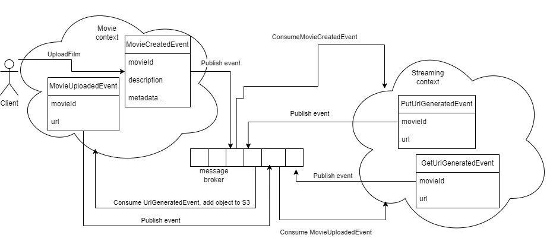

## Выбор плеера

### Варианты

| Плеер          | Плюсы                                                        | Минусы                                                                                                                                                                                                       |
 |----------------|--------------------------------------------------------------|--------------------------------------------------------------------------------------------------------------------------------------------------------------------------------------------------------------|
| video.js       | Может практически всё, благодаря богатой экосистеме плагинов | Имеет самый большой вес (486 kB минифицированного кода) среди конкурентов                                                                                                                                    |         
| html5          | Простой для быстрого старта                                  | Мало функционала из коробки                                                                                                                                                                                  | 
| Shaka Player   | Из коробки реализует работу в офлайне                        | Ограниченная документация: Документация Shaka Player предоставляется в основном в виде примеров кода и описания API. Недостаточно информации для подробного понимания функциональности и возможностей плеера |
| Написать самим | + rep                                                        | Написать что-то нормальное в установленные сроки не видится возможным                                                                                                                                        |

### Выбранный вариант

HTML 5 удовлетворяет нашим требованиям для предоставления подписки на события, происходимые во время просмотров. Поэтому
мы решили выбрать этот плеер.

### Сопоставление событий html 5 и событий в нашей системе

| Событие в нашей системе                    | Событие в html5 | Пример использования                                   |
|--------------------------------------------|-----------------|--------------------------------------------------------|
| STREAM_STARTED_EVENT, STREAM_RESUMED_EVENT | play            | https://www.w3schools.com/tags/av_event_play.asp       |
| STREAM_PAUSED_EVENT                        | pause           | https://www.w3schools.com/tags/av_event_pause.asp      |
| STREAM_SOUGHT_EVENT                        | seeked          | https://www.w3schools.com/tags/av_event_seeked.asp     |
| STREAM_PLAYBACK_PROGRESS_EVENT             | timeupdate      | https://www.w3schools.com/tags/av_event_timeupdate.asp |

## Хранение фильмов

Фильмы будут храниться в s3 хранилище minio.

### Логика взаимодействия с сервисом movie



## Пояснение 

Movie service создаёт новый фильм и публикует новый ивент FilmCreatedEvent, сервис Стриминг подписан на этот ивент, и когда ему приходит этот ивент, стриминг сервис создаёт сыллку по котрой можно загрузить фильм и публикует ивент с этой ссылкой PutURLGeneratedEvent. На PutURLGeneratedEvent подписан MovieService, после того как он получил этот ивент и загрузил фильм, он публикуют ивент FilmUploadedEvent. На FilmUploadedEvent подписан стриминг сервис, который после получения этого ивента создаёт ссылку по которой можно получить фильм и публикует ивент GetURLGeneratedEvent.

Поскольку ссылка на объект имеет ограниченный срок действия, дополнительно предлагается сделать cron job, которая раз в 3 дня будет обновлять ссылку в s3 хранилище на объект.

В стриминг сервисе, будет создана проекция фильма, с помощью которой наш фронт сможет получать актуальную GetURL и передавать ее плееру.

# Как мы будем производить стриминг

## Варианты

### Реализовать стриминг самостоятельно

Выбранный нами плеер производит стриминг путем множественных запросов на указанный источник видео:

Header:
```http request
---
Range: bytes=13500416- // указывает диапазон байт, который необходим для дальнейшего показа видео. 
---
```

Ожидая от нас ответ в виде потока байт.

Формат ответа:

```http request
Accept-Ranges: bytes
Connection: keep-alive
Content-Length: 1000001 // размер текущего чанка 
Content-Range: bytes 13500416-14500416/63614462 // диапазон текущего чанка/весь размер файла
Content-Type: video/mp4
```

На стороне нашего сервиса мы можем конфигурировать размер передаваемых чанков, так чтобы не было провисаний во время видеопоказа
и при этом не было избыточной буфферизации на клиенте. 

Плюсом данного варианта является возможность сделать собсвтенную логику по конфигурации размера передаваемых чанков. 
Минусом является сложность и трудоемкость работ.

### Производить стриминг из S3 хранилища в браузер

При передаче url из S3 хранилища в качестве источника для видеоплеера, S3 хранилище реализует процесс взимодействия с плеером самостоятельно.
Таким образом от нашего сервиса лишь требуется хранить актульные ссылки в S3 и передавать их при запросе на стримнг видео.
Принято решение использовать MinIO в качестве технологии для хранения видеофайлов. MinIO предоставляет открытое программное обеспечение для хранения данных в формате объектов и обеспечивает высокую масштабируемость. Решение принято с учетом наших потребностей в локальном хранении видеоконтента и гибкости, предоставляемой MinIO.

Плюсом является простота реализации.


### Решение

Ввиду ограниченного времени было приянто решение остановиться на варианте со стримингом из S3 хранилища.

